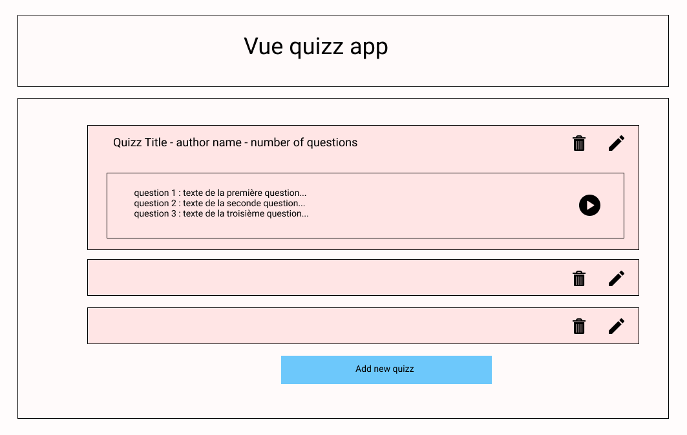
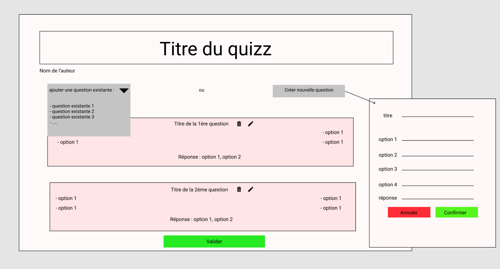
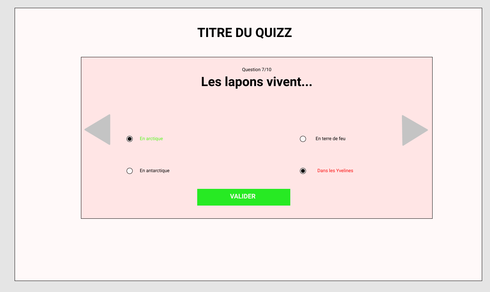

# Description
Pour cet exercice on va développer une app très simple qui *quizz* qui permet à l'utilisateur de
- créer un quizz qui contient lui même une série de questions
- répondre à un quizz et afficher son score

(plus de détails dans les specs ci-dessous où vous pourrez également admirer
un design de haute qualitay fait par un développeur front professionnel 🙄)

Alors disons-le tout de suite, cette app en elle-même n'a absolument aucun intérêt...
Sauf celui de s'exercer sur Vue (on va utiliser une bonne partie des fondamentaux de Vue)
et graphql puisqu'on va créer une app *fullstack* avec une partie serveur (Node/apollo/graphql), elle même
connectée à une base de données *cloud* de type NoSql (Mongo DB Atlas) et une partie front donc avec VueJs.

(A NOTER : Pour simplifier, on ne gèrera pas d'authentification, donc on va considérer que tout le monde peut editer/supprimer/répondre
à tous les quizz)

# Specs

### Home Screen

- [ ]  Doit contenir un bouton *Add new quizz* qui redirige vers `edit-quizz`
- [ ]  Doit afficher la liste de tous les quizz enregistrés en base
- [ ]  comporte un sous-composant `QuizzItem` (en fond rose sur le schéma)
    - [ ]  qui affiche le titre du quizz, le nom de l'auteur et le nombre de questions
    - [ ]  2 boutons d'actions : en cliquant sur delete, le quizz est supprimé (✌), en cliquant sur edit, je suis redirigé vers l'écran `edit-quizz`
- [ ]  si je clique sur un `QuizzItem` je peux voir une "preview" avec les 3 première questions  + un bouton (ici celui avec l'icone play). Si je clique sur ce bouton, je suis redirigé vers l'écran `take-quizz`. ⚠️ *1 seule preview peut être ouverte à la fois*

    

### Edit quizz

- [ ]  En haut de l'écran je dois retrouver le titre du quizz et l'auteur
- [ ]  Affiche la liste de questions du quizz (titre, options et réponse)
- [ ]  je dois pouvoir `delete` et `edit` une question : si je clique sur le crayon, les champs deviennent editables
- [ ]  je dois pouvoir ajouter des questions de 2 façons différentes
    - [ ]  en ajoutant une question déjà existante vie un *select* (quand je clique dessus, j'ai un menu déroulant avec les questions existantes et quand je clique sur une elle s'ajoute aux autres questions du quizz
    - [ ]  en créant une nouvelle question : dans ce cas, s'ouvre un *modal* ou un sous-menu qui me permet de renseigner tous les champs requis (titre, options et réponse)
- [ ]  évidemment un bouton sauvegarder en bas pour... sauvegarder 🙄

Cet écran sert dans 2 cas : editer un quizz existant, ou créer un nouveau quizz puisque les besoins et fonctionnalités sont exactement les mêmes. Dans le premier cas, il fait un fetch et affiche les questions du quizz dans so état initial, dans le second, il n'affiche rien

### Take Quizz

- [ ]  Doit afficher le titre du quizz
- [ ]  Doit afficher les questions 1 par 1 avec ses différentes options à cocher
- [ ]  en cliquant sur valider, les réponses de l'utilisateur deviennent vertes si elles sont correctes, rouge si elles sont fausses
- [ ]  je dois pouvoir naviguer d'une question à une autre en cliquant sur un bouton (ici les 2 flèches)
- [ ]  Une fois que j'ai répondu à toutes les questions, j'ai mon score final qui s'affiche

# Part I - Server side

### [Step 1](./doc/step1.md)

Dans cette étape on va :

- créer un serveur Apollo en spécifiant un `schema`
- connecter notre serveur à une base de données cloud MongoDB Atlas via `mongoose`
- faire nos premières opérations CRUD de base : Read et Write

#### [Step 2](./doc/step2.md)

Dans cette étape on va :

- ajouter un model `Quizz` qui contient lui même une collection de `questions`
- créer la query `allQuizz` pour récupérer les quizz et l'ensemble de ses sous-champs
- créer la mutation `saveQuizz`

### [Step 3](./doc/step3.md)

Dans cette étape on va :

- ajouter la query `quizzById` pour ne fetch qu'uin seul quizz
- créer mutation `deleteQuizz`
- créer la mutation `updateQuestion`

# Part II - Client side

### [Step 4](./doc/step4.md)

Dans cette étape on va :

- installer les outils nécéssaires : Vue CLI, Vue Dev Tools, concurrently
- générer un projet et le configurer grâce à Vue CLI

### [Step 5](./doc/step5.md)

Dans cette étape on va :

- installer les dépendances nécéssaires Vue Apollo, Apollo Boost
- écrire nos premières query ALL_QUESTIONS && ALL_QUIZZ
- s'assurer qu'elles fonctionnenent en les testant dans un composant Vue

### [Step 6](./doc/step6.md)

Dans cette étape on va :

- créer notre système de route
- boostraper nos 3 "views" : Home, EditQuizz et TakeQuizz

### [Step 7](./doc/step7.md)

Dans cette étape on va :

- installer une framework CSS
- créer notre composant Home et la logique qui va avec

### [Step 8](./doc/step8.md)

Dans cette étape on va :

- créer le composant EditQuizz.vue et son sous-composant Question.vue
- gérer la logique pour éditer une question et la sauvegarder en base
- ajouter une question déjà existante au quizz
- ajouter une nouvelle question au quizz
- sauvegarder le quizz
