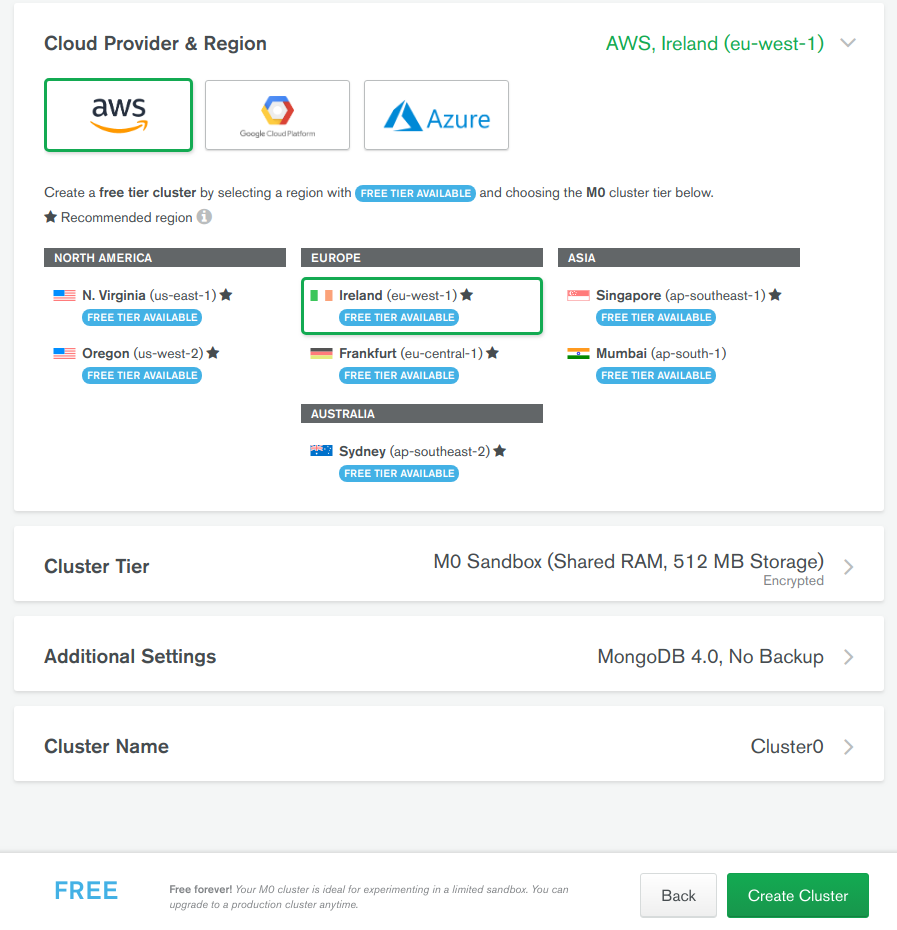
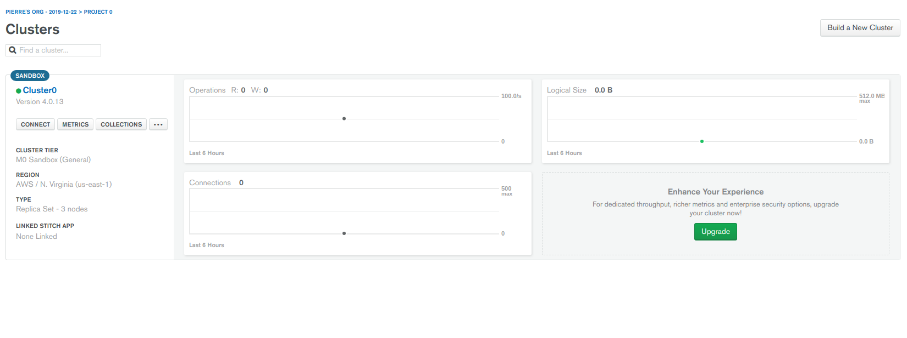
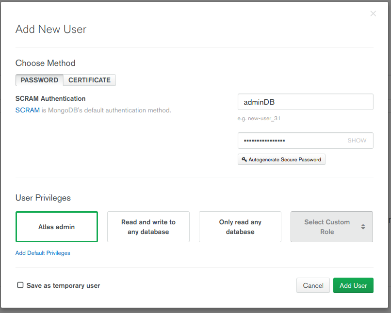
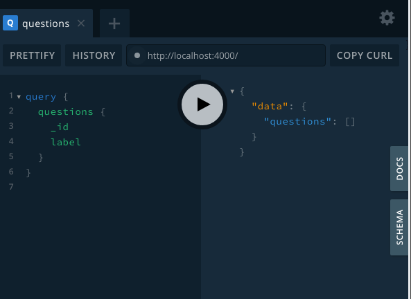
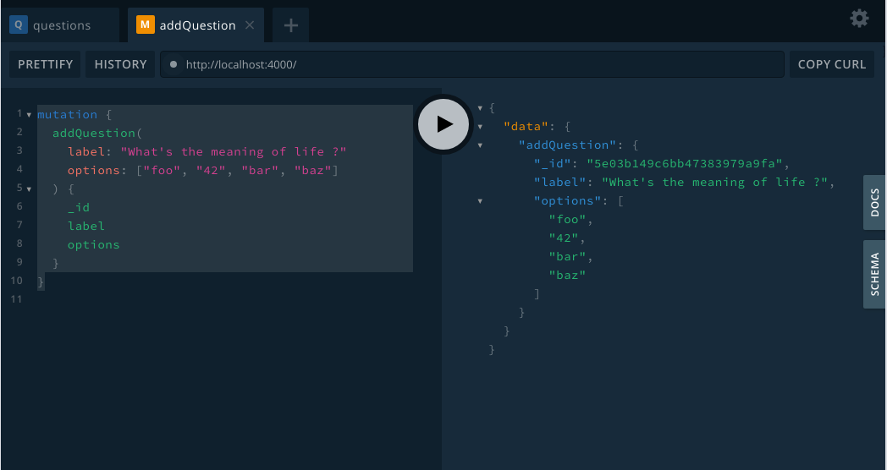

## Apollo Server Setup

Tout est indiqué dans la doc d'Apollo ici [lien](https://www.apollographql.com/docs/apollo-server/getting-started/)

Créer un dossier Vue-apollo-demo (ou le nom que vous voulez) :

```
mkdir vue-apollo
cd vue-apollo
npm init --yes
npm install nodemon
touch index.js typeDefs.graphql resolvers.js

```

C'est la structure de base, le minimum requis pour setup un serveur Apollo.

- `index.js` c'est la qu'on va instancier le `ApolloServer`
- `typeDefs.graphql` le schéma qui définit la structure de données que le client peut `query` (GET) ou `mutate` (POST/PUT/DEL) [GQL Schema and Types](https://graphql.org/learn/schema/)
- `resolvers.js` le controller (au sens rest) : ce sont les fonctions qui vont récéptionner la requête et retourner quelque chose (ou pas!) au client

Pour pouvoir lancer le serveur, on ajoute un script dans `package.json` :

```json
  "scripts": {
    "server": "nodemon index.js",
    ...
    }
```

C'est le moment d'installer Apollo et graphql 🚀 🚀

```shell script
npm install apollo-server graphql
```

##Configuration minimale

1. Dans `index.js`

```js
//sert juste à indiquer le fichier typeDefs.graphql
const fs = require("fs");
const path = require("path");
const filePath = path.join(__dirname, "typeDefs.graphql");

//import du schema et des resovers
const typeDefs = fs.readFileSync(filePath, "utf-8");
const resolvers = require("./resolvers");
//import de ApolloServeur
const { ApolloServer } = require("apollo-server");

// créée une instance de ApolloServer
// avec le schéma qu'on vient d'importer (typeDefs et resolvers)
const server = new ApolloServer({
  typeDefs,
  resolvers
});

server.listen().then(({ url }) => {
  console.log(`🤖🤖 Server listening on ${url}`);
});
```

2. Dans `typeDefs.graphql`

```graphql
type Question {
  _id: ID
  label: String!
  options: [String]!
}

type Query {
  questions: [Question]
}
```

On commence simplement avec un type `Question` et ses différents champs :
notez le `!` pour required et le `[String]` pour signifier un array.
La Query `questions` retourne simplement un array de questions.
L'autre type manquant ici est la `Mutation` qu'on ajoutera par la suite

3.Dans `resolvers.js`

```js
module.exports = {
    Query: {
        questions: async (parent, args, context, info) => {
           ...
        }
    }
};

```

On retrouve la query `questions` qui a été définie plus haut : dans `typeDefs` on dit à Apollo _quel type de données_ on manipule, dans les resolvers, on lui dit _quoi en faire_

/!\ Noter les paramètres de la fonction `parent, args, context, info` sont importants à connaitre (dans les faits on se servira plus des 2 du milieu que des 2 autres)

/!\ [Lire la doc Apollo ici](https://www.apollographql.com/docs/apollo-server/data/data/#resolver-type-signature)

C'est dans cette fonction `questions` qu'on va requêter la base de données pour renvoyer les questions.
Mais on en est pas encore là, on va pour le moment se contenter d'un glorieux :

```js
module.exports = {
  Query: {
    questions: async (parent, args, context, info) => {
      const questions = [
        {
          _id: "87654654",
          label: "première question",
          options: ["1", "2", "3"]
        },
        {
          _id: "1154654",
          label: "test",
          options: ["1", "2", "3"]
        }
      ];
      return questions;
    }
  }
};
```

Maintenant si on `npm run server` ca doit marcher et on doit voir `🤖🤖 Server listening on http://localhost:4000/` s'afficher sur la console 🕺🕺🕺

##Graphql playground

C'est une feature que j'aime beaucoup et qui permet de developper très vite une api en graphql:

Ouvrir le navigateur sur `http://localhost:4000/` :tadaaaam:

Noter les 2 onglets DOCS et SCHEMA à droite dans lesquels on retrouve notre structure. Très pratique pour servir de doc quand un projet commence a prendre de l'ampleur !

Dans la fenêtre de gauche, je peux écrire ma query graphql `questions`

```graphql
query {
  questions {
    _id
  }
}
```

et normalement au clic, apollo me retourne mes questions :

```json
{
  "data": {
    "questions": [
      {
        "_id": "87654654"
      },
      {
        "_id": "1154654"
      }
    ]
  }
}
```

Et évidemment c'est tout l'intérêt de graphql, je peux spécifier exactement ce que je veux en modifiant la requete :

```graphql
query {
  questions {
    _id
    label
  }
}
```

```json
{
  "data": {
    "questions": [
      {
        "_id": "87654654",
        "label": "première question"
      },
      {
        "_id": "1154654",
        "label": "test"
      }
    ]
  }
}
```

## MongoDB Atlas Setup

Pour rendre les choses plus intéréssantes, on va commencer à manipuler de vraies data persistées dans une vrai database.

[Atlas](https://www.mongodb.com/) est une solution SaaS simple à mettre en place et gratuite, parfait pour une démo ou un MVP.

1. Créer un compte
2. Choisir l'option _starter cluster_ gratuite
3. Choisir le provider et la région. J'ai pris AWS/Ireland (mais peu importe...)



On a 512MB de storage ce qui est ammplement suffisant pour cette demo.

Lorsqu'on clique sur créer, et après les 2/3 minutes nécéssaires à la création du cluster,
on arrive sur cette page :



La première chose à faire est de créer un user pour la db avec les droits d'admin :

- a gauche, menu _Database access_ : créer un admin atlas (on aura besoin du nom et mdp plus tard, notez-le bien)



Ensuite il faut whitelist votre IP pour autoriser les READ/WRITE sur la DB :

- Menu _Network Access_ : vous pouvez choisir de n'autoriser que votre IP locale ou d'autoriser toute connexion.

Si vous n'autorisez que votre IP et que vous essayez de vous connecter depuis une autre, il faudra l'ajouter à la main.
Si vous voulez déployer votre app, il faudra autoriser toutes les connections également.

## Connect Apollo to MongoDB Atlas Database

1. Installer Mongoose

`npm install mongoose`

Pour vous connecter à votre db vous avez besoin de son `URI` :

2. Dans Atlas, sur le dashboard de votre projet, onglet `Clusters`
   cliquer sur le bouton `Connect` et choisir l'option `Connnect Your Application`

Copiez-coller le string qui contient le nom d'user et remplacez le mot de passe par le votre :
`mongodb+srv://adminDB:<password>@cluster0-s4tm0.mongodb.net/test?retryWrites=true&w=majority`

Dans `./index.js` avant la creation de votre server :

```javascript
const mongoose = require("mongoose");
const MONGO_URI =
  "mongodb+srv://adminDB:<password>@cluster0-s4tm0.mongodb.net/test?retryWrites=true&w=majority";

mongoose
  .connect(MONGO_URI, {
    useNewUrlParser: true,
    useUnifiedTopology: true,
    useFindAndModify: false
  })
  .then(() => {
    console.log("Database connected");
  })
  .catch(e => {
    console.log(e);
  });
```

Désormais quand on relance le server `npm run server` on voit `database connected` \o/

> ```
> {
>    useNewUrlParser: true,
>    useUnifiedTopology: true,
>    useFindAndModify: false
> }
>
> ```
>
> sont des options de config pour virer les warning de mongoose

Sauf que `MONGO_URI` est un string qui contient l'adresse de votre cluster et vos credentials dont votre mot de passe
que vous ne devez evidemment pas exposer publiquement.

On va donc passer ça dans une variable d'environnement

1. si c'est pas deja fait, créer un `.gitignore`:

```
node_modules
package-lock.json
*.env

```

2. `npm install dotenv`

3.Créer un fichier `variables.env` :

`MONGO_URI=mongodb+srv://adminDB:<password>@cluster0-s4tm0.mongodb.net/test?retryWrites=true&w=majority;`
(notez qu'il n'a pas de `""`)

4.Dans `index.js`, en haut du fichier ajouter `require("dotenv").config({ path: "variables.env" });` puis effacer la const
`MONGO_URI` et remplacer le premier argument de `mongoose.connect()` par `process.env.MONGO_URI`

Désormais bien planqué derrière une variable d'environnement, votre mdp est safe.

## Créer un `question.schema`

Pour que ca fonctionne il faut qu'on dise à Mongoose ce qu'il manipule :

1. Créer un dossier `./models` à la racine
2. A l'intérieur créer `Question.js` qui contiendra notre schema (qu'on n'oublie pas d'exporter à la fin)

```javascript
const mongoose = require("mongoose");

const QuestionSchema = new mongoose.Schema({
  label: {
    type: String,
    required: true
  },
  options: {
    type: [String],
    required: true
  }
});

module.exports = mongoose.model("Question", QuestionSchema);
```

3. Dans `./index.js`, on commence par importer notre schema : `const Question = require("./models/Question.js");`
   avant de l'injecter dans le `context` de notre `ApolloServer` :

```javascript
const server = new ApolloServer({
  typeDefs,
  resolvers,
  context: async ({ req }) => ({
    Question
  })
});
```

C'est le fameux `context` qu'on a vu plus haut dans notre `resolver.js` :

```javascript
Query: {
        questions: async (parent, args, context, info) => {
           ...
        }
    }

```

Puisqu'on sait que désormais, dans `context`, on a `Question`, on peut [déstructurer](https://wesbos.com/destructuring-objects/)
notre objet pour récupérer `Question`.

De plus je sais que je vais pas me servir de `parent`, donc je vais renommer la variable `_`,
idem pour `info` et comme c'est la dernière, je peux juste l'omit

```javascript
Query: {
        questions: async (_, args, { Question }) => {
           ...
        }
    }

```

Reste plus qu'à utiliser la methode `.find()` de [mongoose](https://mongoosejs.com/docs/api.html#model_Model.find)

Ma query `questions` devient :

```
module.exports = {
  Query: {
    questions: async (_, args, { Question }) => {
      const questions = await Question.find();
      return questions;
    }
  }
};
```

On peut maintenant écrire cette query dans le Playground :




Sauf que tant qu'on a pas créer de questions, on récupère logiquement un array vide...


## Graphql Mutations : create question

1. dans `typeDefs.graphql`, ajouter un type `Mutation`:


```graphql
type Mutation {
  addQuestion(label: String!, options: [String]!): Question
}
```

Le nom de la fonction est relativement clair: il prend en paramètre un string `label`
et un array de string `options`, les deux étant obligatoire. Et il retourne la question et la question
sauvée en db.


2. Dans `resolvers.js` :

```javascript
module.exports = {
  Query: {
    questions: async (_, args, { Question }) => {
      const questions = await Question.find();
      return questions;
    }
  },
  Mutation: {
    addQuestion: async (_, { label, options }, { Question }) => {
      const newQuestion = await new Question({ label, options }).save();
      return newQuestion;
    }
  }
};
```

Comme pour la query, je destructure `Question` de l'argument `context`
mais je peux faire pareil pour `args` qui devient `{ label, options }`

>Notez que j'aurais aussi pu faire l'inverse, avec spread operator `...`
>
>````
>addQuestion: async (_, args, { Question }) => {
>       const newQuestion = await new Question( { ...args } ).save();
>       return newQuestion;
>     }
>
>````
>C'est une question de choix, personnelement même si c'est plus 'long'
>Je préfère écrire `{ label, options }` car on voit bien ce qu'on manipule


Maintenant, on peut tester notre mutation sur le playground :




Et si on relance sur l'autre onglet notre query `questions` on récupère bien la question qu'on
vient de créer.

**End of Step 1.**
