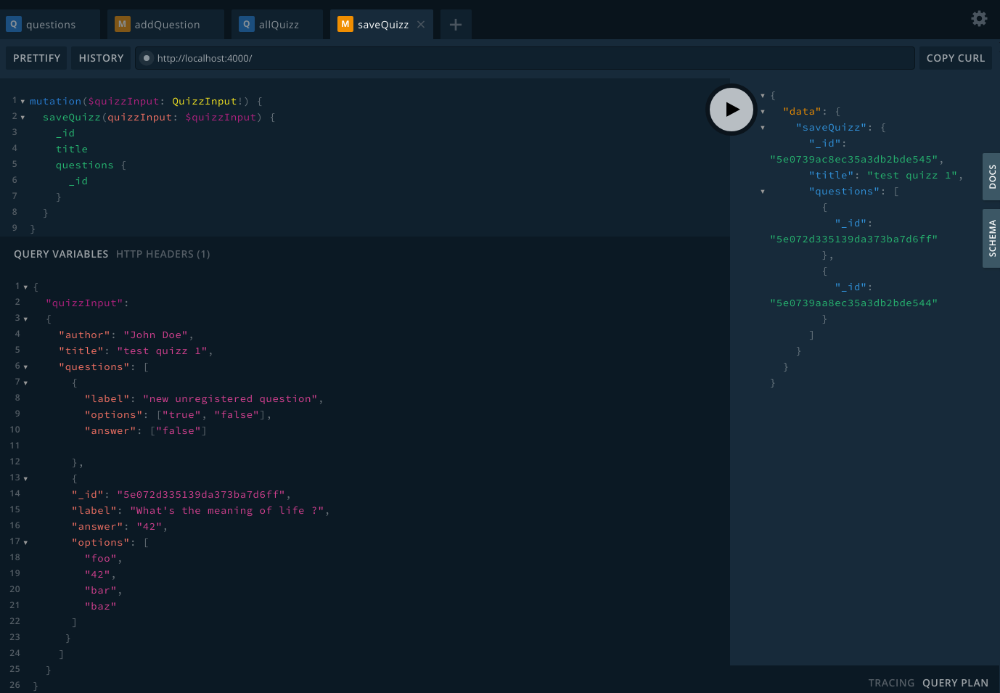
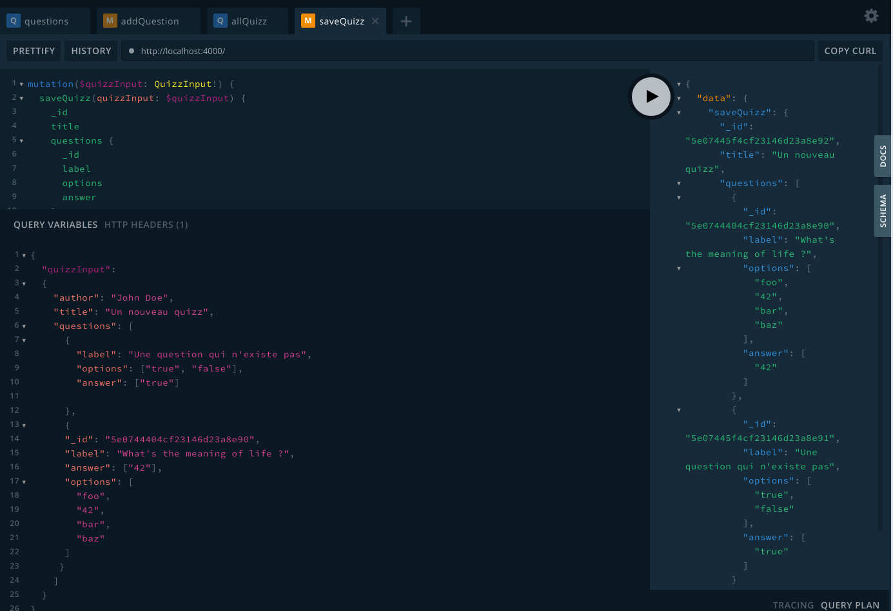

Pour rappel, ce qu'on veut c'est qu'un user puisse créer un `quizz`
contenant plusieurs `questions` et une seule question peut être dans plusieurs quizz.

## Get and create Quizz

**1. Graphql type Quizz**
On va donc commencer par créer un nouveau type `Quizz` avec ses propriétés

Dans `typeDefs.graphql` :

- créer un type quizz avec ses champs
- créer 2 `input` (ne pas confondre avec les types, les arguments des nos resolvers
  doivent être déclarés comme `input`) : `quizzInput`
  qui contient lui-même `questionInput`
- On en profite aussi pour enrichir un peu notre type Question avec une propriété `answer`
  (je la mets en array au cas ou on puisse avoir plusieurs bonne réponses).
- j'ajoute aussi le champ `answer` a ma mutation `saveQuestion` et je mets aussi à jour mon `QuestionSchema`
  dans `./models`
- une nouvelle query `allQuizz` et une nouvelle mutation `saveQuizz` qu'on implémentera dans un second temps

```graphql
type Question {
  _id: ID!
  label: String!
  options: [String]!
  answer: [String]!
}
type Quizz {
  _id: ID
  author: String!
  title: String!
  questions: [Question]!
}
input QuestionInput {
  _id: ID
  label: String!
  options: [String]!
  answer: [String]!
}
input QuizzInput {
  title: String!
  author: String!
  questions: [QuizzInput]!
}
type Query {
  questions: [Question]
  allQuizz: [Quizz]
}
type Mutation {
  addQuestion(label: String!, options: [String]!, answer: [String]!): Question
  saveQuizz(quizzInput: QuizzInput!): Quizz
}
```

**2. Mongoose Model Quizz**

Rien de particulier ici, comme pour `Question`, on créer
un schema Quizz.

Noter `[mongoose.Schema.Types.ObjectId]` qui est un type mongoose renvoyant
à un autre document (ici à un array de documents) via son `_id`

```javascript
const mongoose = require("mongoose");
const QuizzSchema = new mongoose.Schema({
  title: {
    type: String,
    required: true
  },
  author: {
    type: String,
    required: true
  },
  questions: {
    type: [mongoose.Schema.Types.ObjectId],
    required: true
  }
});
module.exports = mongoose.model("Quizz", QuizzSchema);
```

Ne pas oublier d'importer le nouveau model `Quizz` dans `index.js`
avant de l'injecter dans le context d'Apollo.

```javascript
const Question = require("./models/Question.js");
const Quizz = require("./models/Quizz.js");
//...
const server = new ApolloServer({
  typeDefs,
  resolvers,
  context: async ({ req }) => ({
    Question,
    Quizz
  })
});
```

**3. Query `allQuizz`**

Dans `resolvers.js`

```javascript
 Query: {
    questions: async (_, args, { Question }) => {
      const questions = await Question.find();
      return questions;
    },
    allQuizz: async (_, args, { Quizz }) => {
      const allQuizz = await Quizz.find();
      return allQuizz;
    }
  },
  Mutation: {
    addQuestion: async (_, { label, options, answer }, { Question }) => {
      const newQuestion = await new Question({ label, options, answer }).save();
      return newQuestion;
    }
  }
};
```

Si on vérifie dans le playground, la query `allQuizz` fonctionne mais ne
nous retourne que `[]` puisqu'il n'en existe pas encore en base.

**4. Mutation `saveQuizz`**

C'est l'opération qui va nous demander un peu plus de logique: à ce stade,
je ne suis pas certain de ce que je vais recevoir du Front.
Dans le doute je vais considérer que je peux recoir un objet `quizzInput` qui a lui même une
propriété `questionInput` qui contient des questions dont certaines seront déjà
sauvegardées en base (elles ont un `_id`) et d'autres non (elles auront juste `label`, `options` et `answer`).

Dans ce cas, il faut:

1. que je les extrait et les sauvegarde pour récupérer leur `id`
2. que je les merge avec celles qui sont déjà sauvegardées
3. que je sauvegarde mon `quizzInput` pour le retourner

De la même manière, je veux pouvoir me servir de cette mutation dans 2 cas différents
mais qui au fond, font un peu la même chose : sauvegarder un nouveau quizz ou éditer
un quizz déjà existant.

Je vais donc faire un `if/else` sur la présence d'un `_id` dans mon paramètre `quizzInput` :

- si j'ai id (`if(_id){...}` alors je `findOneAndUpdate()`, sinon, je crée un nouveau document Quizz.

```javascript
Mutation: {
  saveQuizz: async (_, { quizzInput }, { Quizz, Question }) => {
    const { questions, title, author } = quizzInput;
    // sort registered from unregistered questions (ie. have an _id or not)
    const unregisteredQuestions = questions.filter(
      question => question && !question._id
    );
    const registeredQuestions = questions.filter(
      question => question && question._id
    );
    //save new questions first to get their _id
    const savedQuestions = [];
    for (const questionToSave of unregisteredQuestions) {
      const savedQuestion = await new Question(questionToSave).save();
      savedQuestions.push(savedQuestion);
    }

    //quizz already exists
    if (_id) {
      const updatedQuizz = await Quizz.findOneAndUpdate(
        { _id },
        {
          questions: [...registeredQuestions, ...savedQuestions],
          title,
          author
        },
        { new: true }
      );
      return updatedQuizz;
    } else {
      newQuizzInput = {
        ...quizzInput,
        questions: [...registeredQuestions, ...savedQuestions]
      };
      const newQuizz = await new Quizz(newQuizzInput).save();
    }
  };
}
```

> NOTE: noter le `for(const ... of ...)` et pas un `forEach` ou un `map` ou un `reduce` :
> [ne pas utiliser `forEach` dans une fonction async](https://stackoverflow.com/questions/37576685/using-async-await-with-a-foreach-loop)

Il y a moyen de le faire avec `Promise.all` mais on va rester simple.

**Tester dans le playground**



- pour éviter de mettre les paramètres assez "velus" de `quizzInput` directement dans la mutation
  on peut utiliser l'option _Query Variables_ en, bas à gauche dans le playground : on déclare ici notre quizzInput
  plus ou moins comme un objet (avec des `""`) et on le référence dans la mutation avec `$ + nom de la variable`
  (ici `$quizzInput`, de type `QuizzInput!`)
- a la ligne suivante : `saveQuizz(quizzInput: $quizzInput){...}` : on déclare notre mutation telle qu'elle est définie dans `typeDefs.graphql`
  sauf qu'en guise de de paramètre `quizzInput` attendu par la mutation, on passe la variable `$quizzInput` qu'on a déclaré une ligne plus haut
- enfin dans le _corps_ de la mutation, on écrit ce qu'on veut récupérer : à savoir `title`,`author` et `questions`

Dans mes questions:

- j'ai copié collé celle que je viens de sauvegarder grace à ma mutation `addQuestion`
  avec son `_id` mais j'en ai aussi claqué une à la main, sans \_id
- on voit dans la réponse à ma requête que je récupère quand même 2 `_id` de question donc ma question claquée en dur
  a bien été sauvegardée d'abord en base. Pour m'en assurer je repasse sur l'onglet `questions` et relance une requête pour avoir toutes mes questions.
- de la même manière, je peux tester qu'en passant un id d'un quizz existant, je modifie ce quizz, alors que si je n'en ai pas, j'en crée un nouveau

Il reste _2 problèmes_ à ce stade dont 1 plutôt bloquant:

- si vous essayez de rajouter des champs à `questions` : par exemple vous voulez récupérer
  le label et les options, vous aurez une erreur graphQL
  `Cannot return null for non-nullable field Question.label.`

C'est du au fait que par défaut mongoose ne renvoie pas tous les champs des sous-documents mais uniquement son ID. Pour avoir tout notre objet question du document
quizz, on doit utiliser dans notre resolver la fonction `.populate()` de [mongoose](https://mongoosejs.com/docs/populate.html)

```javascript
const mongoose = require("mongoose");

const QuizzSchema = new mongoose.Schema({
  title: {
    type: String,
    required: true
  },
  author: {
    type: String,
    required: true
  },
  questions: {
    type: [mongoose.Schema.Types.ObjectId],
    required: true
  }
});

QuizzSchema.post("save", async function() {
  await this.populate({
    path: "questions",
    model: "Question"
  }).execPopulate();
});
```

Et dans `.resolvers.js` je dois aussi utiliser populate dans ma query `allQuizz` et dans le else de `saveQuizz`:
Tant qu'à faire, pour ne pas dupliquer 2 fois la même chose, je l'extrait dans une fonction
en haut du fichier :

```javascript
const populateQuestions = {
  path: "questions",
  model: "Question"
};
```

Ensuite:

```
allQuizz: async (_, args, { Quizz }) => {
  const allQuizz = await Quizz.find().populate(populateQuestions);
  return allQuizz;
},
```

et

```
 if (_id) {
    const updatedQuizz = await Quizz.findOneAndUpdate(
      { _id },
      {
        questions: [...registeredQuestions, ...savedQuestions],
        title,
        author
      },
      { new: true }
    ).populate(populateQuestions);
    return updatedQuizz;
}
```

Maintenant je peux requeter tous les champs de mes questions d'un quizz :



- L'autre point qui est plus de l'ordre de l'amélioration c'est qu'on à 2 boucles qui s'enchainent pour faire
  grosso modo la même chose, à savoir vérifier l'existence ou non de la propriété `_id` :

```javascript
// sort registered from unregistered questions (ie. have an _id or not)
const unregisteredQuestions = questions.filter(
  question => question && !question._id
);
const registeredQuestions = questions.filter(
  question => question && question._id
);
```

Pour le faire en une passe plutôt qu'en deux, le plus simple serait certainement d'utiliser
la fonction `_.partition` de [lodah](https://lodash.com/docs/#partition) :
`const [registeredQuestions, unregisteredQuestions] = _.partition(questions, '_id')`

mais pour l'exercice on va le faire à la main avec un `.reduce()`

<details>
  <summary>Ma version en spoiler (vous pouvez l'améliorer!) :</summary>

```javascript
// sort registered from unregistered questions (ie. have an _id or not)
const { registeredQuestions, unregisteredQuestions } = questions.reduce(
  (sortedQuestions, question) => {
    question._id
      ? sortedQuestions.registeredQuestions.push(question)
      : sortedQuestions.unregisteredQuestions.push(question);
    return sortedQuestions;
  },
  { registeredQuestions: [], unregisteredQuestions: [] }
);
```

</details>

**End of Step 2.**
