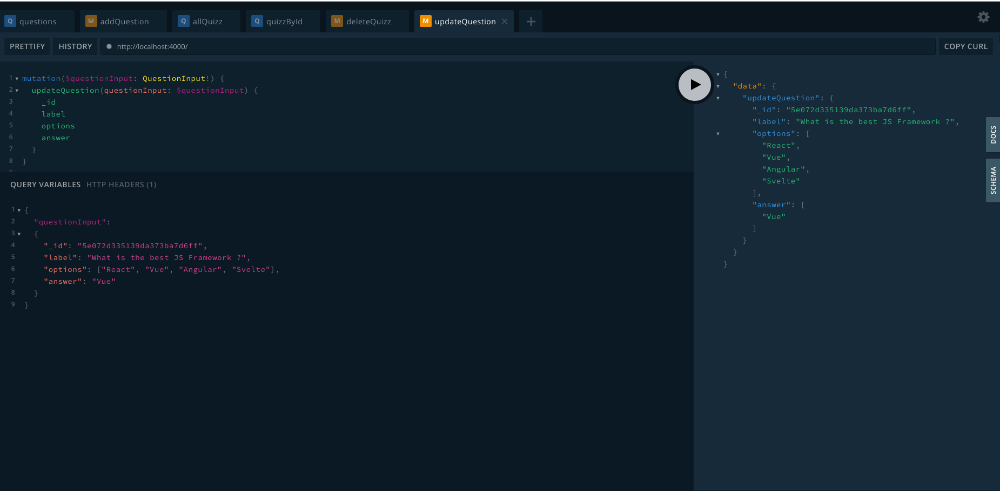

Pour finir nos opérations CRUD, on va préparer une query
supplémentaire pour fetch un seul quizz via son `_id`
et pour boucler la boucle on finira par une fonction delete`deleteQuizz`
et une fonction update `updateQuestion`

## Quizz By ID

1. Dans `typeDefs.graphql` on ajoute la query `quizzById` :

```graphql
type Query {
  questions: [Question]
  quizzById(quizzId: ID!): Quizz
  allQuizz: [Quizz]
}
```

2. Dans `resolvers.js`, on code cette fonction en utilisant la méthode `findById()` de mongoose :

```javascript
  Query: {
   //...
    quizzById: async (_, { quizzId }, { Quizz, Question }) => {
      const quizz = await Quizz.findById(quizzId).populate({
        path: "questions",
        model: "Question"
      });
      if (!quizz) {
        throw new Error(`No quizz found with id ${quizzId}`);
      }
      return quizz;
    }
    //...
  }
```

A noter : si la requête échoue (mauvais ID par exemple), `throw new Error()` stop l'execution
de la fonction et retourne un message. On peut donc se passer du `else` avant le `return quizz`

Maintenant dans le playground si je copie/colle une `_id` de quizz existante, j'ai bien mon quizz
sinon j'ai le message d'erreur que j'ai écrit.

## Delete Quizz

1. Dans `typeDefs.graphql` on ajoute une mutation `deleteQuizz` avec un paramètre `quizzId`

```graphql
type Mutation {
  deleteQuizz(quizzId: ID!): Boolean
}
```

2. dans `resolvers.js`

```javascript
Mutation: {
    //...
    deleteQuizz: async (_, { quizzId }, { Quizz }) => {
      const quizToDelete = await Quizz.findById(quizzId);
      if (!quizToDelete) {
        throw new Error(`No quizz found with id ${quizzId}`);
      }
      await Quizz.deleteOne({ _id: quizzId });
      return true;
    }
  }
```

On s'assure d'abord que le `quizzId` passé en paramètre corresponde bien à un quizz
existant en base de données. Sinon, on renvoie une erreur. Si il existe, on le delete et, histoire de
renvoyer quelque chose, on renvoie un boolean

## Update question

Pour terminer et avoir l'ensemble des opérations du CRUD, on va finir cette partie
par un update.

1. Dans `typeDefs.graphql` j'ajoute une mutation `updateQuestion` qui prend
   comme paramètre `questionInput` (de type `QuestionInput` qu'on a déjà défini pour la création)
   qui est le nouveau contenu de la question

```graphql
type Mutation {
  addQuestion(label: String!, options: [String]!, answer: [String]!): Question
  saveQuizz(quizzInput: QuizzInput!): Quizz
  deleteQuizz(quizzId: ID!): Boolean
  updateQuestion(questionInput: QuestionInput): Question
}
```

2. Dans `resolvers.js` :

```javascript
Mutation: {
    //...
    updateQuestion: async (_, { questionInput }, { Question }) => {
      const { _id, ...questionFields } = questionInput;
      const updatedQuestion = await Question.findOneAndUpdate(
        { _id },
        { ...questionFields },
        { new: true }
      );
      return updatedQuestion;
    }
    //...
}
```

On commence par déstructurer `questionInput` pour extraire `_id` qui va nous permettre
d'indentifierla question à modifier et le reste des propriétés de notre objet question
qui grâce à la magie du _rest operator_ se retrouve sous `...questionsFields`

[`findOneAndUpdate()`](https://mongoosejs.com/docs/api/query.html#query_Query-findOneAndUpdate)
de mongoose prend comme premier paramètre le 'filtre' (ce qui permet d'identifier le document à modifier
(ici, l'id).
Comme les 2 propriétés ont le même nom, au lieu d'écrire `{_id: _id}` je peux simplifier en `{_id}`

Le second sont les modifications à apporter à ce document:
Ici, en admettant que mon `questionInput` a comme sous-propriétés `label, options, answer` (puisqu'on vient d'extraire l'\_id juste avant)
écrire `{...questionFields}` revient à la même chose que d'écrire `{label: label, options: options, answer: answer}`

Magie d'es6, sous la même syntaxe `...` on a d'abord un `rest operator` : `{_id, ...questionFields}` (on rassemble le _reste_)
puis un `spread operator` : `{ ...questionFields }` qui _déstructure_ un objet

Le dernier `{new: true}` sert à dire à mongoose de nous renvoyer le document mis à jour
et non la version précédente.

Maintenant dans le playground, si je passe une `id` d'une question qui existe déjà avec un nouveau contenu,
je récupère bien mes changements.



**End of Step 3.**
