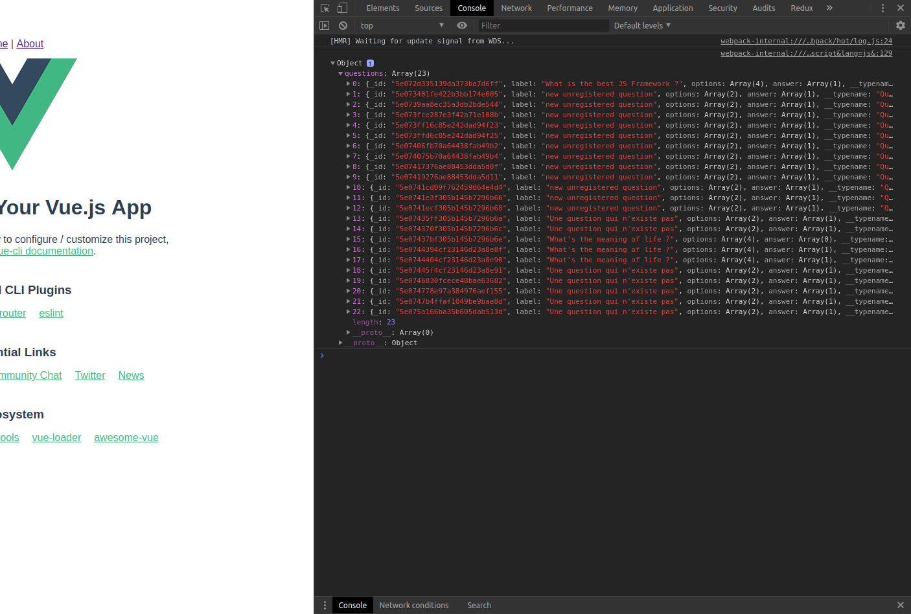

A ce stade, on a une API graphql, un front en Vue JS
mais les deux ne communiquent pas encore ensemble.
On va donc y remédier.

## Installer les dépendances apollo-boost et VueApollo

Il faut commencer par installer `ApolloClient` et `VueApollo`.

> /!\ Attention, on a maintenant 2 `package.json` différents : un pour le back, à la racine du projet et un second dans `./client` qui liste les dépendances du front (du projet Vue quoi)
> Il faudra faire attention à faire `npm install` au bon endroit : si votre terminal est à la racine du projet et que vous essayer d'installer une dépendance liée à Vue, ca ne fonctionnera pas, obviously!

1. Une fois dans le dossier client, avec le terminal :

```shell
npm install apollo-boost vue-apollo
```

2. dans le dossier `./client/src`, ouvrir le fichier `main.js`

```javascript
import Vue from "vue";
import App from "./App.vue";
import router from "./router";
import ApolloClient from "apollo-boost";
import VueApollo from "vue-apollo";

Vue.use(VueApollo);

Vue.config.productionTip = false;

const API_URI = "http://localhost:4000";

export const defaultClient = new ApolloClient({
  uri: `${API_URI}/graphql`,
  fetchOptions: {
    credentials: "include"
  }
});

const apolloProvider = new VueApollo({ defaultClient });

new Vue({
  apolloProvider,
  router,
  render: h => h(App)
}).$mount("#app");
```

Rien de très compliqué :

- on commence par importer les 2 dépendances qu'on a installées: `import ApolloClient from "apollo-boost"; import VueApollo from "vue-apollo";`

- `Vue apollo` est un plugin développé spécialement pour Vue. Une fois importé, il faut l'injecter dans l'instance de Vue en commençant par `Vue.use(VueApollo)`

* ensuite on déclare une const pour l'uri de notre api graphql sur laquelle notre client va taper. En graphql, au contraire de REST, on n'a qu'un seul
  endpoint qui finit par `/graphql`. A noter: une fois en prod, il faudra évidemment changer la valeur de ce string car `localhost` ne marche qu'en mode developpement.

* on instancie un ApolloClient en lui passant l'URI : `export const apolloProvider...`

* on passe ce `defaultClient` dans VueApollo : `const apolloProvider = new VueApollo({ defaultClient });`

* et enfin, on injecte `apolloProvider` dans l'instance de Vue qu'on crée avec `new Vue({...})`

A partir de maintenant notre front et notre serveur peuvent communiquer \o/...

Encore faut-il créer nos Query et Mutation côté client, c'est ce qu'on va faire tout de suite.

## Ecrire les premières Query et Mutations dans le front

- Créer un dossier `api` sous `./client` (./client/api)
- à l'interieur, on va créer un fichier par "type" d'objet qu'on manipule :
  - un fichier `questions.js`
  - un fichier `quizz.js`

1. dans `questions.js` :

```
import { gql } from "apollo-boost";

export const ALL_QUESTIONS = gql`
  query {
    questions {
      _id
      label
      options
      answer
    }
  }
`;

```

- il faut d'abord importer `{ gql }` depuis apollo-boost

- ensuite on déclare une const (je l'écrit en Maj par convention mais ça n'est pas obligatoire). C'est cette const qu'on appelera dans nos composants
  (oubliez pas l'export du coup, sinon ca pourra pas marcher.

- à l'intérieur des `` vous avez juste à copier coller ce que vous avez testé dans le playground aux étapes précédentes

2. dans `quizz.js`, on refait exactement la même chose :

```javascript
import { gql } from "apollo-boost";

export const ALL_QUIZZ = gql`
  query {
    allQuizz {
      _id
      author
      _id
      title
      questions {
        _id
        label
        options
        answer
      }
    }
  }
`;
```
3. Tester nos query dans un composant Vue

Juste pour s'assurer que ce qu'on vient de faire marche bien, on va essayer notre query `ALL_QUESTIONS` dans un composant.


On va le faire dans le composant `HelloWorld.vue` qui est généré automatiquement par Vue CLI à la création d'un nouveau projet.


Dans `HelloWorld.vue`, on commence par importer notre query `ALL_QUESTIONS`, déclarer une `method` qu'on appelera `fetchQuestions` et appeler cette méthode dans le
 lifecycle hook `mounted` :


```javascript
<script>
import { ALL_QUESTIONS } from "./../../api/questions.js";
export default {
  name: "HelloWorld",
  props: {
    msg: String
  },
  methods: {
    async fetchQuestions() {
      const { data } = await this.$apollo.query({ query: ALL_QUESTIONS });
      console.log(data);
    }
  },
  async mounted() {
    await this.fetchQuestions();
  }
};
</script>

```
(notez le `$apollo` qui vient du plugin `Vue Apollo`)

Et là, normalement, si on refresh le navigateur, en console, vous devez voir le résultat du console.log, avec dessous, votre array de questions !



Vous pouvez pour vous entrainer, faire pareil avec `ALL_QUIZZ`, ca devrait fonctionner pareil.

***

On a maintenant l'assurance que notre front en Vue est correctement cablé à l'api GraphQL. La prochaine étape est de développer l'application à proprement parler.

**End of Step 5**
