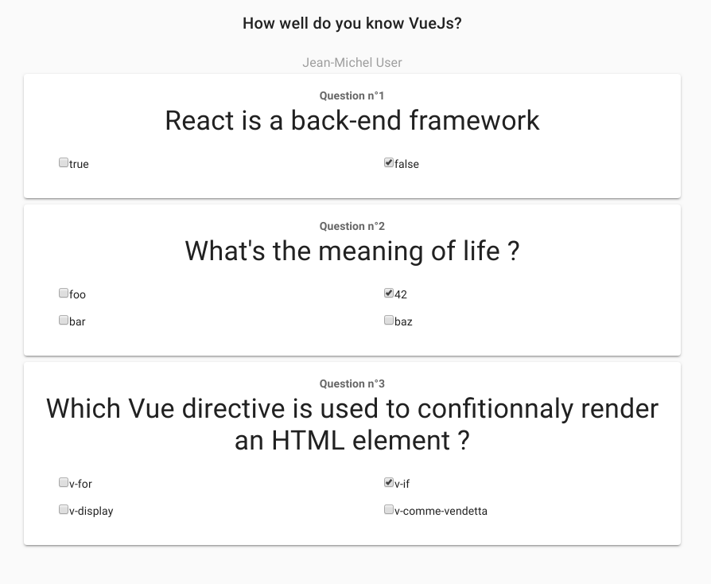

# EditQuizz.vue

Quand on relis les specs de ce composant, on se rend compte que mine de
rien, il y a pas mal de choses à faire ici. Quand c'est comme ça, avant de
commencer à coder, on se pose 5 minutes et on décompose en petites tâches
auxquelles on va s'attaquer une par une... Bref, on _prend les matchs les uns après les autres_ !

1. fetch le quizz si on a une id, et gérer le cas où on est dans un contexte
   de création d'un nouveau
2. afficher le contenu du quizz (si on en a 1) dans le template et prévoir un contenu par défaut
   si on en a pas
3. éditer une question du quizz
4. ajouter une nouvelle question
5. ajouter une question déjà existante
6. sauvegarder le quizz modifié et rediriger vers la home

### fetch quizz by id

`EditQuizz.vue` :

```html
<template>
  <div>
    <section class="header"></section>
    <section class="addQuestions"></section>
    <section class="quizzQuestions"></section>
    <section class="saveQuizz"></section>
  </div>
</template>

<script>
  import { QUIZZ_BY_ID } from "../../api/quizz";

  export default {
    name: "EditQuizz",
    data() {
      return {
        quizz: null
      };
    },
    async mounted() {
      if (
        this.$route.params &&
        this.$route.params.id &&
        this.$route.params.id !== "new"
      ) {
        const { data } = await this.$apollo.query({
          query: QUIZZ_BY_ID,
          variables: { quizzId: this.$route.params.id }
        });
        this.quizz = data.quizzById;
      }
    }
  };
</script>

<style scoped></style>
```

Il faut aussi qu'on écrive cette query. Dans `./api/quizz.js` , on ajoute notre query :

```javascript
export const QUIZZ_BY_ID = gql`
  query($quizzId: ID!) {
    quizzById(quizzId: $quizzId) {
      _id
      author
      title
      questions {
        _id
        label
        options
        answer
      }
    }
  }
`;
```

Au passage, on remarquera ce truc pas très joli et très verbeux pour éviter de se manger une erreur `cannot read property id of undefined` qui ferait tout péter
au cas où on ait pas de params ou pas d'id :

```javascript
if (
    this.$route.params &&
    this.$route.params.id &&
    this.$route.params.id !== "new"
  ){...}
```

Heureusement, c'est bientôt du passé grâce au nouveau [`optional chaining operator`](https://developer.mozilla.org/en-US/docs/Web/JavaScript/Reference/Operators/Optional_chaining).
On pourra faire simplement `if(this.$route?.params?.id !== 'new'){...}` qui est quand même nettement plus élégant !

- On commence par déclarer dans `data` une variable `quizz` qu'on initialise à `null`
- Sur le hook `mounted` on fait une requête `async` (à condition d'avoir une id différente de `new`) :
  une query GQL `QUIZZ_BY_ID` avec en variable l'id que je récupère de mon `$route.params`
- je réassigne ma variable `quizz` avec l'objet que je reçois de ma requête

Pour le moment on ne voit rien à l'écran mais si je fais un `console.log` ou si j'affiche le state d emon composant dans Vue Dev Tools, je vois
que ma variable quizz contient bien ce que je veux.

Dans mon template, je peux donc maintenant afficher pour commencer le titre de mon quizz (ou un titre par defaut si je suis en mode creation)

```html
<section class="header">
  <h1 class="title text-center pa-5">
    {{ quizz ? quizz.title : "New quizz Title" }}
  </h1>
  <h2 class="subtitle-1 text-center grey--text">
    {{ quizz.author ? quizz.author : "Author name" }}
  </h2>
</section>
```

### Display Questions

On est toujours dans le cas d'une édition, donc on part du principe qu'on a des questions qui
ont chacune 1 ou plusieurs bonnes réponses.

Pour me faciliter la tâche, je vais d'abord _extraire_
mes questions pour les réassigner dans une data du composant, ca me permet de l'initialiser en `[]` et d'éviter d'avoir une erreur quand quizz vaut `null`.
Ca nous facilitera aussi la tâche quand il s'agira d'éditer/sauvegarder notre quizz comme on le verra après :

```javascript
data() {
    return {
      quizz: null,
      questions: []
    };
  },
```

et dans le hook mounted:

```javascript
this.quizz = data.quizzById;
this.questions = this.quizz.questions;
```

Maintenant dans la partie template:

```html
<section class="quizzQuestions">
  <v-card
    class="mx-auto mb-2"
    v-for="(question, index) in questions"
    :key="question._id"
  >
    <v-card-text>
      <h4 class="text-center">Question n°{{ index + 1 }}</h4>
      <h3 class="display-1 text--primary text-center">
        {{ question.label }}
      </h3>

      <div class="text--primary justify-space-between d-flex row mt-3">
        <v-flex
          xs6
          v-for="(option, i) in question.options"
          :key="i"
          class="px-10 mt-3"
        >
          <input
            type="checkbox"
            :id="`${question._id}--${option}`"
            :checked="isCorrect(option, question.answer)"
          />
          <label :for="`${question._id}--${option}`" class="pb-1"
            >{{ option }}</label
          >
        </v-flex>
      </div>
    </v-card-text>
  </v-card>
</section>
```

- je refais un v-for pour afficher mes options dans chaque question
- pour chaque option, j'affiche un input de type checkbox avec son label
- en html natif, vous feriez `<input type="checkbox" checked>` pour que la checkbox soit cochée.
  Sur Vue, n'importe quel attribut natif d'un élément html peut devenir dynmique si vous lui collez `:` devant. Pratique !
  Donc pour savoir si une réponse est la bonne, il suffit de faire un `:checked="uneMethodeCustom"` où `uneMethodeCustom` retourne un boolean

Du coup, ma méthode `isCorrect()` est très simple :

```javascript
methods: {
    isCorrect(option, answers) {
      return answers.includes(option);
    }
}
```

Maintenant les bonnes réponses sont cochées, les autres non.
Voilà ce que ca devrait donner chez vous :



### Edit mode

Ici encore, c'est plus simple et plus _propre_ de refactoriser pour mettre
la logique d'édition dans un composant `Question.vue`

- Dans `./components` créer un nouveau fichier `Question.vue`

```html
<template>
  <v-card class="mx-auto mb-2">
    <v-card-text>
      <h4 class="text-center">Question n°{{ questionIndex }}</h4>
      <h3 class="display-1 text--primary text-center">
        {{ question.label }}
      </h3>

      <div class="text--primary justify-space-between d-flex row mt-3">
        <v-flex
          xs6
          v-for="(option, i) in question.options"
          :key="i"
          class="px-10 mt-3"
        >
          <input
            type="checkbox"
            :id="`${question._id}--${option}`"
            :checked="isCorrect(option, question.answer)"
          />
          <label :for="`${question._id}--${option}`" class="pb-1"
            >{{ option }}</label
          >
        </v-flex>
      </div>
    </v-card-text>
    <v-card-actions class="d-flex justify-center">
      <v-btn icon color="green accent-4">
        <v-icon>mdi-pencil</v-icon>
      </v-btn>
      <v-btn icon color="red accent-4">
        <v-icon>mdi-delete</v-icon>
      </v-btn>
    </v-card-actions>
  </v-card>
</template>

<script>
  export default {
    name: "Question",
    props: {
      question: {
        type: Object,
        default: () => {}
      },
      questionIndex: {
        type: Number,
        default: 1
      }
    },
    methods: {
      isCorrect(option, answers) {
        return answers.includes(option);
      }
    }
  };
</script>

<style scoped></style>
```

- dans `EditQuizz.vue`

```html
<section class="quizzQuestions">
  <Question
    v-for="(question, index) in questions"
    :key="question._id"
    :question="question"
    :questionIndex="index + 1"
  />
</section>
```

(je précise plus mais évidemment, dans la partie script, il faut importer le composant)

- Dans `Question.vue`, je crée dans data une variable `newQuestion` grâce à un [watcher](https://vuejs.org/v2/guide/computed.html#Computed-vs-Watched-Property) sur la props
  va valoir exactement ce que j'ai dans la props `question`.
  Pourquoi ? Ca parait idiot. Tout simplement parce que je vais voiloir modifier
  le contenu de `question` (changer son label, ses options, sa réponse...) et si j'essaie de
  modifier directement une props en faisant par exemple `this.question.label = "A new label"`,
  Vue va me crier dessus : il n'est pas possible de muter directement une props : c'est un
  [anti-pattern et c'est mal !](https://medium.com/javascript-in-plain-english/avoid-mutating-a-prop-directly-7b127b9bca5b)

- ensuite je crée une autre variable qui est un boolean `isEditMode` qui me permet d'afficher
  ma question en mode affichage simple (je peux rien modifier) ou en mode edition (dans ce
  cas, mon titre par exemple devient un input modifiable avec en `v-model` (2 way data binding) `newQuestion.label`

- je cable 2 boutons, 1 pour confirmer mes changement qui va emit `newQuestion` ainsi que l'index
  pour que le composant parent mette à jour la question... qui va ensuite 'resecendre' en props, trigger
  mon watcher pour boucler la boucle...

```html
<template>
  <v-card class="mx-auto mb-2">
    <v-card-text>
      <h4 class="text-center">Question n°{{ questionIndex + 1 }}</h4>
      <h3 v-if="!isEditMode" class="display-1 text--primary text-center">
        {{ question.label }}
      </h3>
      <v-text-field v-else v-model="newQuestion.label"></v-text-field>

      <div class="text--primary justify-space-between d-flex row mt-3">
        <v-flex
          xs6
          v-for="(option, i) in question.options"
          :key="i"
          class="px-10 mt-3"
        >
          <input
            type="checkbox"
            :id="`${question._id}--${option}`"
            :checked="isCorrect(option, question.answer)"
            :disabled="!isEditMode"
          />
          <label :for="`${question._id}--${option}`" class="pb-1"
            >{{ option }}</label
          >
        </v-flex>
      </div>
    </v-card-text>
    <v-card-actions class="d-flex justify-center">
      <template v-if="!isEditMode">
        <v-btn icon color="green accent-4" @click="isEditMode = !isEditMode">
          <v-icon>mdi-pencil</v-icon>
        </v-btn>
        <v-btn icon color="red accent-4">
          <v-icon>mdi-delete</v-icon>
        </v-btn></template
      >
      <template v-else>
        <v-btn text color="green accent-4" @click="handleConfirmClick">
          <v-icon>mdi-content-save</v-icon>
          <span class="green--text ml-2">Save</span>
        </v-btn>
        <v-btn text color="red accent-4" @click="handleCancelClick">
          <v-icon>mdi-close-circle</v-icon>
          <span class="red--text ml-2">Cancel</span>
        </v-btn>
      </template>
    </v-card-actions>
  </v-card>
</template>
<script>
  export default {
    name: "Question",
    props: {
      question: {
        type: Object,
        default: () => {}
      },
      questionIndex: {
        type: Number,
        default: 1
      }
    },
    watch: {
      question: {
        immediate: true,
        handler(questionProps) {
          if (questionProps) {
            const { label, options, answer } = questionProps;
            this.newQuestion = { label, options, answer };
          }
        }
      }
    },
    data() {
      return {
        newQuestion: {
          label: "",
          options: [],
          answer: []
        },
        isEditMode: false
      };
    },
    methods: {
      isCorrect(option, answers) {
        return answers.includes(option);
      },
      handleConfirmClick() {
        this.$emit("onQuestionEdited", this.newQuestion);
        this.isEditMode = false;
      },
      handleCancelClick() {}
    }
  };
</script>
<style scoped></style>
```

- du côté du parent (`EditQuizz`) maintenant :

```html
<Question
  v-for="(question, index) in questions"
  :key="question._id"
  :question="question"
  :questionIndex="index"
  @onQuestionEdited="
          newQuestion => handleQuestionEdited(newQuestion, index)
        "
/>
```

et la méthode `handleQuestionEdited`

```javascript
  methods: {
    handleQuestionEdited(newQuestion, index) {
      this.questions[index] = newQuestion;
    }
  },
```

Ca parait logique... et pourtant, c'est le drame ! Quand on regarde sur Vue dev tools
on voit que notre question a bien été modifiée et pourtant c'est toujours l'ancienne
valeur qui est affichée à l'écran :'(

C'est LE piège classique du système de réactivité sur Vue (qui n'est pas dû à Vue à proprement parler
d'ailleurs : voir [ici](https://vuejs.org/v2/guide/reactivity.html#Change-Detection-Caveats)

Pour dire à Vue explicitement de re-render l'UI, on doit ici utiliser `Vue.set`
ou `this.$set` qui est un peu l'équivalent de la fonction `setState` de React :

Donc au lieu de `this.questions[index] = newQuestion;` on fait `this.$set(this.questions, index, newQuestion)`
(le premier paramètre est l'array dont un des index est à modifier (ou l'objet si c'est un objet), le second c'est l'index à modifier (ou la propriété dans le
cas d'un objet), et le dernier c'est la nouvelle valeur

Et là, on a bien nos changements dans le composant questions

- pour éditer les réponses à une question maintenant

```html
<input
  type="checkbox"
  :id="`${question._id}--${option}`"
  :checked="isCorrect(option, question.answer)"
  :disabled="!isEditMode"
  @input="event => handleOptionCheck(event, option)"
/>
```

On écoute l'event natif de l'element `input` pour déclencher une méthode
qui prendra comme paramètre cet event + l'option

Ensuite, il suffit de faire :

```javascript
handleOptionCheck(event, option) {
      if (event.target.checked) {
        this.newQuestion.answer.push(option);
      } else {
        this.newQuestion.answer = this.newQuestion.answer.filter(
          a => a !== option
        );
      }
    }
```

Si la checkbox est cochée, on ajoute la valeur de l'option à notre array de `answer`
Sinon, on la supprime.

On a maintenant la logique dans le composant pour éditer le contenu de la question.
Sauf que rien n'est fait pour que ce nouveau contenu soit sauvegardé en base.

Pour ça, il faut donc faire le nécéssaire dans `EditQuizz.vue` :

```javascript
async handleQuestionEdited(newQuestion, index) {
  const { __typename, ...questionInput } = newQuestion;
  const { data } = await this.$apollo.mutate({
    mutation: UPDATE_QUESTION,
    variables: { questionInput }
  });
  this.$set(this.questions, index, data.updateQuestion);
}

```

- on rend notre méthode async et on appelle la mutation gql qui update la question
  en lui passant la nouvelle valeur. Notez que je dois me débarasser de `__typename`
  (qui est 'fourni' automatiquement par apollo, car mon `QuestionInput` déclaré dans `typedefs.graphql`
  ne prévoit pas ce champ)

- évidemment, pour que ca fonctionne, il faut que je déclare ma mutation dans
  `./api/questions.js` :

```javascript
export const UPDATE_QUESTION = gql`
  mutation($questionInput: QuestionInput!) {
    updateQuestion(questionInput: $questionInput) {
      _id
      label
      options
      answer
    }
  }
`;
```

puis que je l'importe dans mon composant :

```javascript
import { QUIZZ_BY_ID } from "../../api/quizz";
import { UPDATE_QUESTION } from "../../api/questions";
import Question from "@/components/Question";
```

